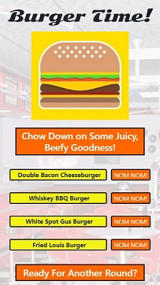

# burger
"Burger Time" is a full stack application that utilizes

# Instructions
Simple...JUST EAT! Click on the "Nom Nom!" button to devour the corresponding burger. It will be queued up in the "Ready For Another Round?" area where you can reorder it or delete it. You can also create a new burger in the "Build Your Own!" section by typing in the name (25 character limit) and clicking the "Order Up!" button.

# Demo
A demo of the application can be found on Heroku at https://stark-cliffs-52381.herokuapp.com/.

**Desktop Application View**\


**Mobile Application View**\


## Resources
This was created with **Node.js**, **Express**, **MySQL**, and **Handlebars**, following the Model View Controller design pattern. The following package installs were utilized:

**Express**
```
npm i express
```

**Express-Handlebars**
```
npm i express-handlebars
```

**MySql**
```
npm i mysql
```
